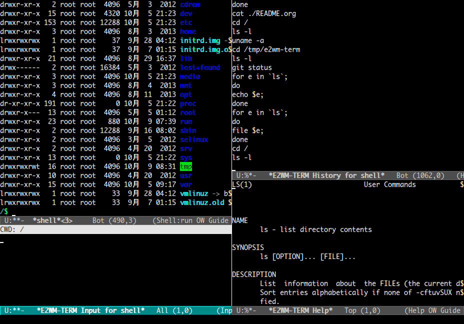

# これは何？

Emacsの拡張で、ターミナル上での作業向けの  のパースペクティブです。  



# 特徴

-   改行ではないキーでコマンドを実行することで、意図せずコマンド投入してしまうのを回避できます
-   改行キーが単に改行するだけなので、コマンドをエスケープ無しに複数行に分けて記述できます
-   入力用バッファに入力中のコマンドのヘルプを自動で表示します
-   ヘルプを表示するコマンドは、ターミナルのバッファで実行せずに、専用のバッファに実行結果を表示します
-   コマンド履歴を専用のバッファに表示し、それらを素早く利用できます

# インストール

### package.elを使う場合

2014/10/09 melpaリポジトリからインストール可能

### el-get.elを使う場合

2014/10/09 利用可能。ただし、masterブランチのみです。

### auto-install.elを使う場合

```lisp
(auto-install-from-url "https://raw.github.com/aki2o/e2wm-term/master/e2wm-term.el")
```
-   下記の依存拡張もそれぞれインストールする必要があります

### 手動の場合

e2wm-term.elをダウンロードし、load-pathの通った場所に配置して下さい。
-   下記の依存拡張もそれぞれインストールする必要があります

### 依存拡張

-   
-   
-   

# 設定

### はじめに

```lisp
(require 'e2wm-term)
```

### デフォルトのバックエンドの選択

バックエンドとは、メインウィンドウに表示されるターミナルのバッファの種類を指します。  
当パースペクティブが開始される時は、 `e2wm-term:default-backend` が使われます。(デフォルトは `shell` )  
利用可能なバックエンドの確認は、M-x `e2wm-term:show-backends` 、  
バックエンドの詳細は、M-x `e2wm-term:describe-backend` として下さい。  

### コマンド投入用のキー

デフォルトでは、 `C-RET` です。  
変更したい場合は、以下のように `e2wm-term:input-mode-map` を変更して下さい。  

```lisp
(e2wm:add-keymap
 e2wm-term:input-mode-map
 '(("C-m" . e2wm-term:input-invoke-command)
   ) e2wm:prefix-key)
```

### ヘルプ表示コマンドの制御と判別

当パースペクティブは、 `e2wm-term:help-guess-command` の設定に従って、
ヘルプを表示するコマンドを投入する際の挙動を、以下のように制御します。  
-   `t` の場合 &#x2026; メインウィンドウで実行せずに、ヘルプウィンドウに実行結果を表示する
-   `ask` (デフォルト) の場合 &#x2026; ヘルプウィンドウに実行結果を表示するかどうかを尋ねる
-   `nil` の場合 &#x2026; 通常のコマンドと同じく、メインウィンドウで実行する

また、コマンドがヘルプを表示するコマンドかどうかの判別には、 `e2wm-term:help-guess-regexp` が使われます。  
デフォルトでは、"git help status"のように"help"という単語が含まれているコマンドにマッチします。  

また、"&#x2013;help"オプションが指定されているコマンドの場合は、常にヘルプウィンドウに実行結果を表示します。  

### 入力中のコマンドのヘルプ表示

入力中のコマンドについて、 `e2wm-term:command-helper` を使って、そのヘルプを自動でヘルプウィンドウに表示します。  

### カレントディレクトリの更新

入力用ウィンドウのヘッダに、現在のカレントディレクトリを表示し、  
`e2wm-term:command-cwd-checker` / `e2wm-term:command-cwd-updaters` に従って、更新します。  

### ページャ

ページャの設定には、 `e2wm-term:command-pager` / `e2wm-term:command-pager-variables` が使われます。  
当パースペクティブの開始時に、 `e2wm-term:command-pager-variables` の環境変数の値が
`e2wm-term:command-pager` に一時的に置き換えられます。  

### その他

その他の設定項目の確認は、M-x `customize-group` "e2wm-term" として下さい。  

# 使い方

### 開始

M-x `e2wm-term:dp` もしくは、M-x `e2wm:pst-change-command` して"term"を選択

### コマンドの入力と投入

コマンドを通常通り入力します。複数行で入力する時でも、改行のエスケープは不要です。  
入力したら、 `e2wm-term:input-invoke-command` に割り当てたキーでコマンド投入します。  

### ターミナルウィンドウの操作

メインウィンドウには、コマンド投入対象のターミナルバッファが表示されています。  
入力用バッファからは、ターミナルバッファと同じキーマップでターミナルバッファを操作できます。  
例えば、ターミナルバッファが `shell-mode` の時、入力用バッファで `C-c C-c` とすれば、
ターミナルバッファ上で `comint-interrupt-subjob` が実行されます。  
-   但し、 `e2wm-term:input-mode-map` に定義されたキーは除きます

### コマンド履歴の操作

次のキーが定義されています。 `prefix` は `e2wm:prefix-key` を意味します。  
-   `e2wm-term:history-move-previous` ( `C-c C-p` / `prefix p` ) &#x2026; 前の履歴に移動
-   `e2wm-term:history-move-next` ( `C-c C-n` / `prefix n` ) &#x2026; 次の履歴に移動
-   `e2wm-term:input-history-previous` ( `M-p` ) &#x2026; 前の履歴に移動して、入力バッファに貼り付け
-   `e2wm-term:input-history-next` ( `M-n` ) &#x2026; 次の履歴に移動して、入力バッファに貼り付け
-   `e2wm-term:history-send-pt-point` ( `prefix i` ) &#x2026; ポイントしている履歴を入力バッファに貼り付け
-   `e2wm-term:history-grep` ( `prefix g` ) &#x2026; 履歴を絞り込み
-   `e2wm-term:history-show-all` ( `prefix a` ) &#x2026; 絞り込み解除

### ヘルプウィンドウの操作

ヘルプウィンドウのメジャーモード `e2wm-term:help-mode` は、 `view-mode` を継承しています。  
ヘルプウィンドウの操作を止めるには、 `q` を押して下さい。  
また、その他に以下のキーが定義されています。 `prefix` は `e2wm:prefix-key` を意味します。  
-   `e2wm-term:dp-help-toggle-command` ( `prefix h` ) &#x2026; ヘルプウィンドウの表示/非表示の切り替え
-   `e2wm-term:dp-help-maximize-toggle-command` ( `prefix H` ) &#x2026; ヘルプウィンドウの最大化の切り替え

### ターミナルバッファの選択

現在のバックエンドのバッファが複数ある場合には、
`e2wm-term:dp-select-main-buffer` ( `prefix t` ) で選択できます。  

### バックエンドの追加

`e2wm-term:regist-backend` を使って下さい。  

# 留意事項

### ページャ

ターミナルでは一般的に、コマンドの実行結果が長い場合にそれを閲覧するためのページャプログラムには、  
"less"コマンドなどのインタラクティブなプログラムを用います。  
しかし、そのようなプログラムがターミナルバッファで動作しても、入力バッファから操作ができません。  
そのため、当パースペクティブではデフォルトで、"cat"コマンドをページャとして利用しています。  
ページャの設定については、上記の"設定"の"ページャ"セクションを参照して下さい。  

### コマンド終端文字

ターミナルでは、以下のようにコマンド終端文字(/bin/shなら";")は省略できます。  

```sh
~$ for e in `ls`
> do
> echo $e
> done
```

しかし、入力バッファでは省略できないので、以下のように記述する必要があります。  

```sh
for e in `ls`;
do
echo $e;
done
```

# 動作確認

-   Emacs &#x2026; GNU Emacs 24.3.1 (i686-pc-linux-gnu, GTK+ Version 3.4.2) of 2014-02-22 on chindi10, modified by Debian
-   e2wm.el &#x2026; 1.2
-   log4e.el &#x2026; 0.2.0
-   yaxception.el &#x2026; 0.3.2

**Enjoy!!!**
